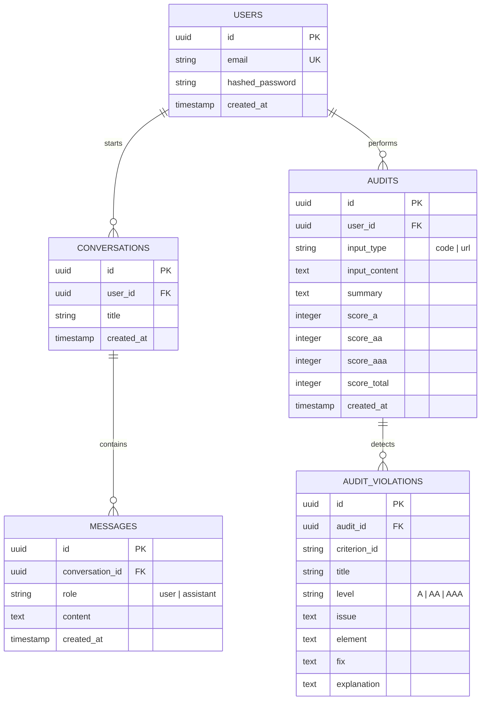

# 🤖 WCAG AI Copilot: Enterprise-Grade RAG Accessibility Advisor

A premium, end-to-end full-stack AI platform designed to audit web code markup and live public URLs against the official **WCAG 2.2 guidelines**. Powered by a conversational RAG pipeline, a custom multi-step LangGraph workflow, hybrid dense-sparse vector search, and a secure PostgreSQL-backed user history layer.

---

## 📐 1. System Architecture

The WCAG AI Copilot is built as a highly decoupled, modern AI-native web application. The frontend functions as a stateless client that strictly routes all requests through the FastAPI gateway, which handles scraping, vector search, agent execution, and session vaulting:

```mermaid
graph TD
    subgraph Frontend (React + TypeScript)
        UI[App.tsx Dashboard]
        Gate[Session Gate / Auth]
        Side[History Sidebar]
        QA[Advisor QA Pane]
        Pane[Advisor Workspace Pane]
    end

    subgraph Backend (FastAPI + Python)
        API[FastAPI Routers]
        AuthHandler[JWT & Bcrypt Security]
        Scraper[Playwright Scraper]
        Graph[LangGraph Agent Graph]
    end

    subgraph Storage Layer
        Postgres[(PostgreSQL Database)]
        Qdrant[(Qdrant Hybrid Vector DB)]
    end

    %% Connections
    UI -->|Session Init / GET me| API
    Gate -->|Login & Register Requests| API
    Side -->|History Queries & Detail Lookups| API
    QA -->|Chat Messages / POST chat/qa| API
    Pane -->|Audit Executions / POST chat| API
    
    API -->|Authenticate Sessions & Fetch Logs| Postgres
    API -->|Query Vector Context| Qdrant
    API -->|Scrape Target HTML| Scraper
    API -->|Execute Agentic Nodes| Graph
    Graph -->|Retrieve Dense + Sparse Vectors| Qdrant
```

---

## 🚀 2. Core Features

### 🕵️‍♂️ Intelligent Accessibility Audits
- **Markup Auditing**: Paste raw HTML, CSS, or JSX directly into the editor for compliance evaluation.
- **Headless Live URL Scanner**: Provide any public website URL. The backend spins up a headless **Playwright** browser, scrapes the dynamic DOM hierarchy, cleans extraneous nodes (like metadata and scripts) to optimize token windows, and evaluates it.

### 🔗 Multi-Step LangGraph Agent
- Evaluates code against accessibility criteria through a state-mutating directed graph:
  - **Analyze Node**: Extracts page structure and retrieves relevant guidelines.
  - **Evaluate Node**: Pins code elements against WCAG guidelines using GPT-4o.
  - **Suggest Node**: Formulates precise, copy-paste-ready HTML/CSS code corrections and calculates violation scores.

### 📚 Conversational RAG Q&A
- A dedicated chat pane powered by **Conversational RAG**. It takes natural language developer questions, queries a hybrid vector index containing the 86 official WCAG success criteria and techniques, and streams context-grounded answers token-by-token.

### 🔐 Secure Database Vault
- Center-gated authentication wrapper utilizing secure password hashing (`bcrypt`) and stateless `HS256` JWT tokens.
- Persistent SQL storage logging user audits, violations, message threads, and conversation metadata, loaded instantly via a collapsible side history drawer.

---

## 🛠 3. Technical Implementation Details

### Hybrid Vector Search (Dense + Sparse)
The ingestion pipeline crawls official W3C guidelines and indexes them into **Qdrant** using a dual-embedding strategy:
*   **Dense Vectors**: Generated via FastEmbed (`text-embedding-3-small` equivalent) to capture semantic and conceptual relationships.
*   **Sparse Vectors**: Generated via SPLADE (`prithivida/Splade_PP_en_v1`) to perform precise keyword matching, ensuring that references to specific Success Criteria numbers (e.g., `1.4.11`) or WCAG techniques (e.g., `G207`) are resolved with absolute accuracy.

### Relational Database Schema (PostgreSQL)
The application logs session metadata asynchronously using **SQLAlchemy** on top of `asyncpg` to prevent blocking FastAPI’s event loop during heavy computational workloads:



---

## 📦 4. Installation & Local Setup

### Prerequisites
Make sure you have Docker, Node.js (v18+), and Python 3.12+ (with the `uv` package manager) installed.

### 1. Database & Qdrant Containers
Spin up Qdrant and PostgreSQL:
```bash
docker compose up -d
```

### 2. Configure Environment Variables
Create a `.env` file in the root directory:
```env
# PostgreSQL Configuration
POSTGRES_HOST=localhost
POSTGRES_PORT=5432
POSTGRES_DB=wcag_ai
POSTGRES_USER=admin
POSTGRES_PASSWORD=admin123

# Vector Database
QDRANT_URL=http://localhost:6333
QDRANT_COLLECTION=wcag_criteria

# OpenAI Core
OPENAI_API_KEY=your_openai_api_key_here

# JWT Configuration
JWT_SECRET_KEY=your_secure_jwt_secret_key
```

### 3. Ingest Accessibility Guidance
Run the document crawler to scrape, chunk, and embed official WCAG techniques into Qdrant:
```bash
# Dry run verification (limit to 20 pages, no writes)
uv run python -m app.ingestion.ingest --max-pages 20 --dry-run

# Run full ingestion
uv run python -m app.ingestion.ingest --max-pages 250
```

### 4. Run the Backend API
Install Python dependencies and start the uvicorn API reload server:
```bash
uv sync
uv run uvicorn app.main:app --host 127.0.0.1 --port 8000 --reload
```
*The database tables will be auto-created on application startup.*

### 5. Run the React Frontend
Navigate to the frontend folder, install packages, and start Vite:
```bash
cd frontend
npm install
npm run dev
```
*Access the dashboard at `http://localhost:5173`.*

---

## ♿ 5. UI Accessibility Conformance
The frontend is designed to comply with WCAG 2.2 guidelines:
*   **WAI-ARIA status logs**: Streaming thought containers use `role="log"` and `aria-live="polite"` so updates are announced dynamically to screen readers.
*   **Label controls**: Form fields, filter groups, and search inputs are paired with descriptive `<label>` links (using Tailwind's `sr-only` to keep the UI clean but accessible).
*   **Visible Focus States**: Custom blue borders (`focus:ring-blue-500`) are active across all form inputs and button selections to aid keyboard-only navigation.
