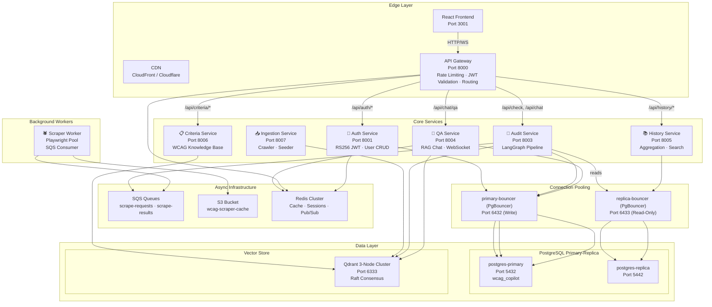
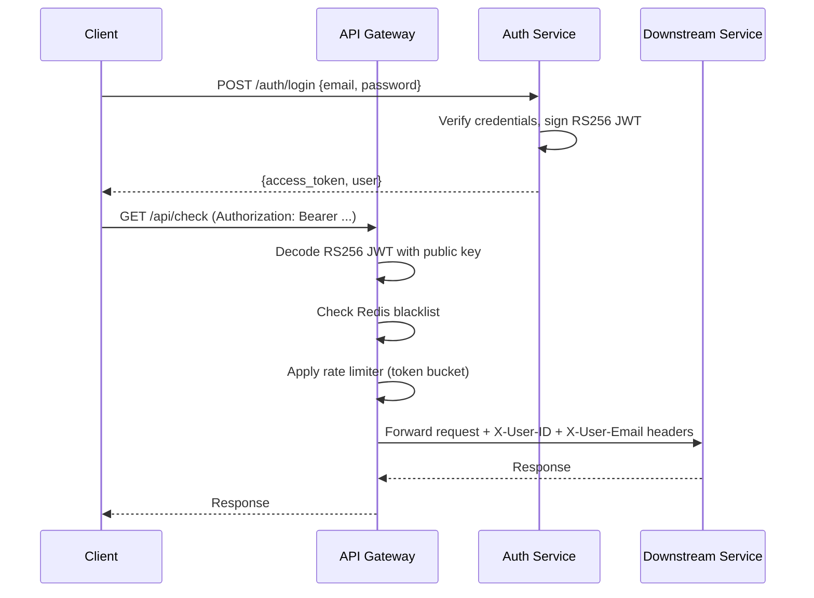
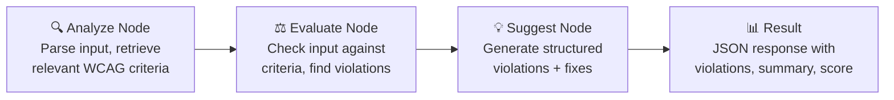
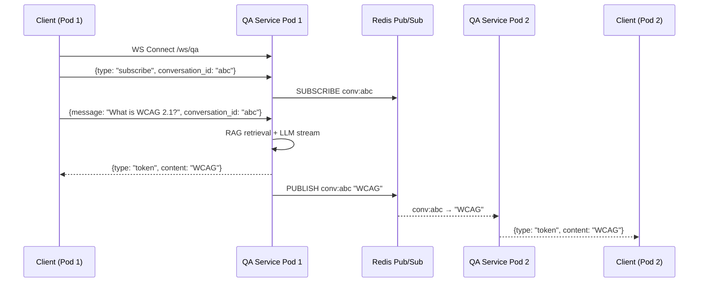

# WCAG AI Copilot — Architecture Overview

> A production-grade, horizontally-scalable microservices platform for automated WCAG accessibility auditing powered by LLM agents.

---

## System Architecture

---

## Service Catalog

| Service | Port | Database | Key Responsibility |
|---|---|---|---|
| **API Gateway** | 8000 | — | Edge routing, JWT validation, rate limiting |
| **Auth Service** | 8001 | `wcag_copilot` (PG 5432/5442) | User registration, login, RS256 token issuance |
| **Audit Service** | 8003 | `wcag_copilot` (PG 5432/5442) | LangGraph accessibility audit pipeline |
| **QA Service** | 8004 | `wcag_copilot` (PG 5432/5442) | RAG-based Q&A with WebSocket + SSE streaming |
| **History Service** | 8005 | `wcag_copilot` (PG 5432/5442) | Aggregated audit/chat history with search |
| **Criteria Service** | 8006 | Qdrant | WCAG criteria read API with Redis caching |
| **Ingestion Service** | 8007 | Qdrant | WCAG spec crawler and vector store seeder |
| **Scraper Worker** | — | — | Async URL scraping via Playwright + SQS |

---

## Authentication Flow

- **Token Type**: RS256 asymmetric JWT (see [ADR 002](adr/002-rs256-jwt.md))
- **Access Token TTL**: 30 minutes
- **Refresh Token TTL**: 7 days (Redis-backed blacklist)
- **Rate Limiter**: Token bucket algorithm (100 tokens, 2/sec refill) via Redis Lua script

---

## Audit Pipeline (LangGraph)

The core audit engine uses a LangGraph `StateGraph` with three sequential nodes:

Each node makes an LLM call through the **Provider Abstraction Layer** (see [ADR 004](adr/004-llm-provider-abstraction.md)):
- Priority chain: OpenAI → NVIDIA NIM → Local fallback
- Circuit breaker: 5 failures in 60s trips the provider for 5 minutes
- Response caching: SHA-256 content hash with 24h Redis TTL

---

## Real-Time Chat (WebSocket)

See [ADR 006](adr/006-websocket-redis-pubsub.md) for the full design rationale.

---

## Data Architecture

### Consolidated Database Model

All services utilize a single, unified database instance (`wcag_copilot`) with logical separation of responsibilities maintained in the public schema by unique table naming structures. This allows simple referential integrity and reduces deployment complexity while preserving high scalability through dedicated read-only standbys.

| Schema / Service | Tables | Partitioning |
|---|---|---|
| Auth Service | `users` | None |
| Audit Service | `audits`, `audit_violations` | Monthly range partitioning on `created_at` |
| QA Service | `conversations`, `messages` | Monthly range partitioning on `created_at` |

### Connection Pooling (PgBouncer)

Services communicate with the database via two PgBouncer sidecars operating in **transaction-level pooling** mode:
1. **`primary-bouncer`** (Port `6432`): Routes write operations to the primary master database (`postgres-primary` on container port `5432`).
2. **`replica-bouncer`** (Port `6433`): Routes read-only operations to the read-only standby database (`postgres-replica` on host port `5442`).

### Vector Store (Qdrant)

- **Collection**: `wcag_criteria`
- **Cluster**: 3-node Raft consensus
- **Embeddings**: Hybrid dense (OpenAI `text-embedding-3-small`) + sparse (FastEmbed SPLADE)
- **Search**: Reciprocal Rank Fusion (RRF) of dense and sparse results

---

## Shared Library (`wcag-common`)

The `packages/wcag-common` package provides shared infrastructure used by all services:

| Module | Purpose |
|---|---|
| `wcag_common.config` | `BaseServiceSettings` (Pydantic settings with DB URL builders) |
| `wcag_common.config.secrets` | Runtime secrets provider (AWS Secrets Manager / env fallback) |
| `wcag_common.models.*` | Shared Pydantic schemas (auth, audit, chat, queue) |
| `wcag_common.sqs` | SQS queue client wrappers |
| `wcag_common.s3` | S3 object storage wrappers |
| `wcag_common.observability.metrics` | Prometheus middleware (request rate, latency histograms) |
| `wcag_common.observability.logging` | Structured JSON logging with correlation IDs |
| `wcag_common.observability.tracing` | OpenTelemetry trace instrumentation |
| `wcag_common.auth` | `decode_access_token()` RS256 JWT verification |

---

## Deployment Architecture

### Local Development
- **Docker Compose**: Full stack with all services, databases, Redis, Qdrant
- **Skaffold + Kind**: Local Kubernetes testing with Helm charts

### Production (Kubernetes)
- **Helm Chart**: `deploy/charts/wcag-copilot` with per-service deployments
- **HPA**: Horizontal Pod Autoscaling based on CPU utilization
- **PDB**: Pod Disruption Budgets for zero-downtime rolling updates
- **NetworkPolicy**: Backend services only reachable from API Gateway
- **Ingress**: Path-based routing with WebSocket `/ws` direct to QA Service

### CI/CD (Jenkins)
- Git diff change detection for selective builds
- Parallel test + build stages per service
- Docker image push to ECR
- Helm chart deployment to EKS

See the [Runbook](runbook.md) for operational procedures.
