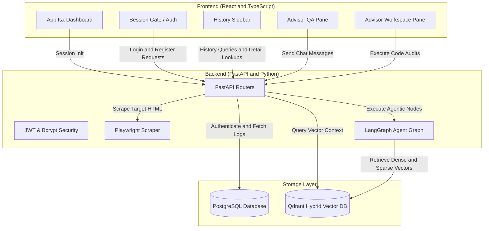
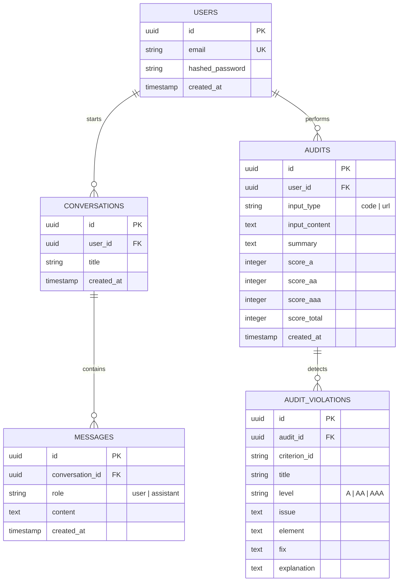
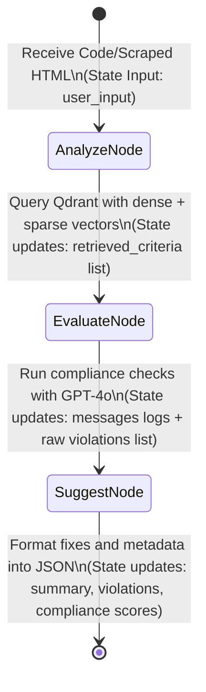

# 📖 WCAG AI Copilot: Comprehensive System Documentation & Codebook

Welcome to the ultimate system documentation for the **WCAG 2.2 AI Copilot**. This document serves as a complete blueprint, explaining every architectural layer, database schema, API router, agentic node, and React interface in clear human language.

---

## 📐 1. System Architecture Overview

The WCAG AI Copilot is built as a highly decoupled, modern AI-native web application. Below is the global overview of how the layers connect, strictly routing all client calls through the FastAPI gateway:

---

## 📂 2. Database Schema & Data Models

The relational storage is powered by **PostgreSQL** using **SQLAlchemy** to interface asynchronously. Below is the detailed Entity Relationship Diagram (ERD):

### 🧠 Code Logic (Database):
*   [session.py](file:///Users/imrankhan/Developer/projects/AI/wcag-ai-copilot/app/db/session.py): Initialises database engines. We maintain two engines:
    1.  `async_engine` (uses `postgresql+asyncpg`): Executes async transactions during API calls to prevent blocking the event loop.
    2.  `sync_engine` (uses `postgresql+psycopg2`): Synchronously runs tables creation checks on application lifespan startup (`Base.metadata.create_all`).
*   [models.py](file:///Users/imrankhan/Developer/projects/AI/wcag-ai-copilot/app/db/models.py): Establishes SQLAlchemy tables mapping Python classes to PostgreSQL. UUIDs are dynamically generated locally using Python's `uuid.uuid4`. We use `selectinload` when querying child relationships (`messages` or `violations`) to fetch dependencies efficiently.

---

## 🔐 3. Authentication & Authorization Security

Secure authentication is handled with stateless JSON Web Tokens (JWT) and direct password hashing.

### 🧠 Code Logic (Security):
*   [auth.py](file:///Users/imrankhan/Developer/projects/AI/wcag-ai-copilot/app/api/auth.py): Uses the standard `bcrypt` library directly to hash passwords securely (instead of the obsolete `passlib` library which crashes on Python 3.12+).
    *   `get_password_hash(password)`: Generates a cryptographically secure random salt using `bcrypt.gensalt()` and hashes the utf-8 encoded password.
    *   `verify_password(plain, hashed)`: Compares a plain password against the stored bcrypt hash in a timing-attack-safe manner.
    *   `create_access_token(data)`: Signs a JWT payload containing the user's ID (`sub`) with a secret key using the `HS256` hashing algorithm.
*   [deps.py](file:///Users/imrankhan/Developer/projects/AI/wcag-ai-copilot/app/api/deps.py): Implements dependency injections:
    *   `get_current_user`: Extracts the OAuth2 Bearer token from the incoming request header. Decodes the token using the `SECRET_KEY`, extracts the user ID, queries the database, and returns the authenticated `User` object. If the token is missing, expired, or invalid, it immediately raises an HTTP `401 Unauthorized` exception.
*   [auth_routes.py](file:///Users/imrankhan/Developer/projects/AI/wcag-ai-copilot/app/api/routes/auth_routes.py): Exposes Auth endpoints:
    *   `POST /auth/register`: Inserts a new user. Hashes the password and returns a newly signed JWT token and user info.
    *   `POST /auth/login`: Validates password credentials, returning a signed JWT token on success.
    *   `GET /auth/me`: Retrieves the active user record based on the `get_current_user` dependency.

---

## 🤖 4. The LangGraph Advisor Workflow

When code or a URL is audited, the request enters **LangGraph**. The workflow runs across three nodes within a structured state, mutating variables step-by-step:

### 🧠 Code Logic (Agentic Workflow):
*   `AgentState` ([state.py](file:///Users/imrankhan/Developer/projects/AI/wcag-ai-copilot/app/agent/state.py)): A typed dictionary representing the graph's memory:
    *   `user_input`: The raw code input or Playwright-scraped HTML body.
    *   `retrieved_criteria`: Matching WCAG guidelines fetched dynamically from Qdrant.
    *   `messages`: Chain of reasoning logs and conversational history.
    *   `violations`: Formatted list of identified accessibility failures.
    *   `summary`: A high-level overview explaining the compliance state.
    *   `score`: Breakdown counts for levels A, AA, AAA, and total compliance percentage.
*   `Analyze Node` ([nodes.py](file:///Users/imrankhan/Developer/projects/AI/wcag-ai-copilot/app/agent/nodes.py)): Cleans the markup and retrieves relevant WCAG guidelines from Qdrant using vector similarity search.
*   `Evaluate Node` ([nodes.py](file:///Users/imrankhan/Developer/projects/AI/wcag-ai-copilot/app/agent/nodes.py)): Combines the user code with the retrieved WCAG context, evaluates compliance using GPT-4o, and identifies structural issues.
*   `Suggest Node` ([nodes.py](file:///Users/imrankhan/Developer/projects/AI/wcag-ai-copilot/app/agent/nodes.py)): Generates detailed corrections, provides explanations, computes a compliance rating, and formats the output into structured JSON.

---

## 📡 5. Backend API Routers & Ingestion Pipeline

FastAPI acts as the asynchronous backend controller, exposing core endpoints and executing the scraping pipeline:

### 🧠 Code Logic (FastAPI Controllers):
*   [check.py](file:///Users/imrankhan/Developer/projects/AI/wcag-ai-copilot/app/api/routes/check.py): Offers single-shot checking. Integrates a headless Playwright scraper to render and check public URLs directly. Saves the completed audit and violations to PostgreSQL under the active user.
*   [chat.py](file:///Users/imrankhan/Developer/projects/AI/wcag-ai-copilot/app/api/routes/chat.py): Exposes:
    *   `POST /chat`: Streams token-by-token reasoning using Server-Sent Events (SSE) as the LangGraph agent executes nodes. Saves the completed audit report to PostgreSQL on completion.
    *   `POST /chat/qa`: A conversational RAG endpoint. Extracts semantic keywords from user questions, retrieves matching WCAG context from Qdrant, streams answers, and logs message histories to PostgreSQL.
*   [history.py](file:///Users/imrankhan/Developer/projects/AI/wcag-ai-copilot/app/api/routes/history.py): Offers secure logs retrieval:
    *   `/history/chats`: Lists past chat threads.
    *   `/history/chats/{id}`: Returns messages for a specific conversation.
    *   `/history/audits`: Lists past audits.
    *   `/history/audits/{id}`: Returns scores and violations for a past audit.

### 🧠 Code Logic (Ingestion Pipeline):
*   [ingest.py](file:///Users/imrankhan/Developer/projects/AI/wcag-ai-copilot/app/ingestion/ingest.py): Responsible for crawling accessibility guidelines from official W3C/WAI sources. Chunks documents, embeds them using dual encoders (dense embeddings via FastEmbed and sparse keyword representations), and inserts them into Qdrant.
*   [fetcher.py](file:///Users/imrankhan/Developer/projects/AI/wcag-ai-copilot/app/ingestion/fetcher.py): Implements a Playwright crawler wrapper to scrape public web content headless, handling dynamically rendered pages.

---

## 🎨 6. Frontend Hooks, Login Gate, & Sidebar

The frontend is built using React and TypeScript, fully secured behind an authentication gate, and designed with high-contrast, premium WCAG accessibility standards.

### 🧠 Code Logic (Frontend Components):
*   [App.tsx](file:///Users/imrankhan/Developer/projects/AI/wcag-ai-copilot/frontend/src/App.tsx): Centrals user flow. If unauthenticated, it center-renders the login form. Once logged in, it mounts the dashboard, binding global callbacks to reload historical reports.
*   [useAuth.ts](file:///Users/imrankhan/Developer/projects/AI/wcag-ai-copilot/frontend/src/hooks/useAuth.ts): Creates a global React Context provider. Keeps track of token, loading state, registration calls, and fetches `/auth/me` on launch.
*   [HistorySidebar.tsx](file:///Users/imrankhan/Developer/projects/AI/wcag-ai-copilot/frontend/src/components/HistorySidebar.tsx): Toggles open from the left. Lists audits and chats. Clicking an item queries the backend details endpoint and triggers state restoration in the main pane.
*   [useQA.ts](file:///Users/imrankhan/Developer/projects/AI/wcag-ai-copilot/frontend/src/hooks/useQA.ts) & [AdvisorQA.tsx](file:///Users/imrankhan/Developer/projects/AI/wcag-ai-copilot/frontend/src/components/AdvisorQA.tsx): Handles chat history threads. Listens for the backend-generated `conversation_id` SSE event to link subsequent messages to the same thread in PostgreSQL.
*   [useChat.ts](file:///Users/imrankhan/Developer/projects/AI/wcag-ai-copilot/frontend/src/hooks/useChat.ts): Handles SSE client connection, updating active nodes (`analyze` -> `evaluate` -> `suggest`) and displaying the final results.

---

## ♿ 7. WCAG 2.2 Accessibility Checks In the UI

To achieve high accessibility compliance, the frontend includes:
1.  **Form Controls**: Visually hidden but descriptive `<label>` elements linked to search inputs and scanner forms, aiding screen readers.
2.  **Live Log updates**: Streaming thought containers configured with `role="log"` and `aria-live="polite"` so updates are announced dynamically.
3.  **Visual Focus Triggers**: High-contrast blue rings on input focus (`focus:ring-blue-500`) to aid keyboard-only navigation.
