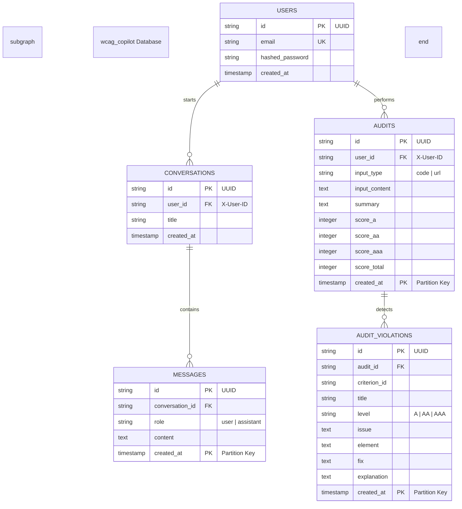
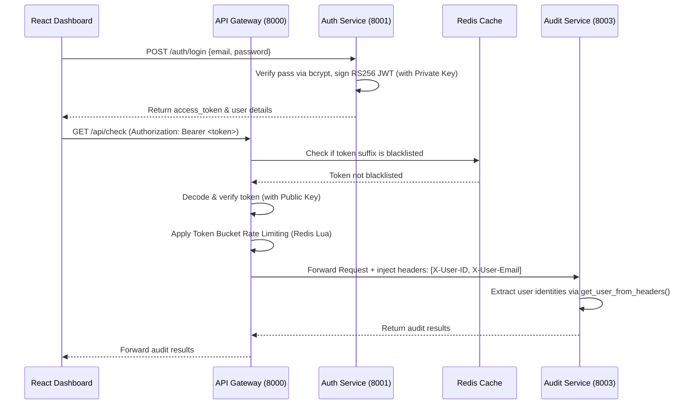
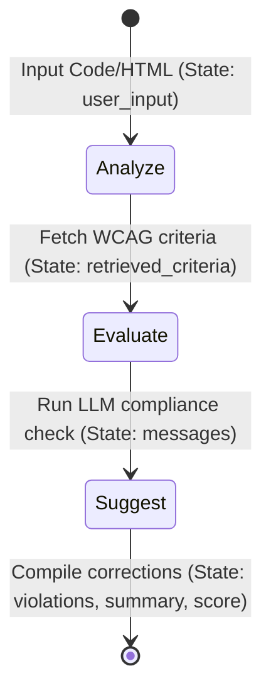

# 📖 WCAG AI Copilot: Microservices System Documentation & Codebook

Welcome to the ultimate system documentation for the **WCAG 2.2 AI Copilot** in its modern, decoupled microservices architecture. This document serves as a complete blueprint, explaining every service, database schema, API gateway router, agentic node, and React interface in clear human language.

---

## 📐 1. System Architecture Overview

The WCAG AI Copilot is built as a highly decoupled, production-grade microservices platform. All external request traffic routes through a unified **API Gateway**, which manages authentication, rate limiting, and request routing. 

Below is the global overview of the microservices topology:

```mermaid
graph TD
    subgraph "Edge Layer"
        UI[React Frontend Dashboard<br/>Port 3001]
        GW[API Gateway<br/>Port 8000]
    end

    subgraph "Core Microservices"
        AuthSvc[🔐 Auth Service<br/>Port 8001]
        AuditSvc[🤖 Audit Service<br/>Port 8003]
        QASvc[💬 QA Service<br/>Port 8004]
        HistSvc[📚 History Service<br/>Port 8005]
        CritSvc[📋 Criteria Service<br/>Port 8006]
        IngSvc[📥 Ingestion Service<br/>Port 8007]
    end

    subgraph "Async Infrastructure"
        SQS["SQS Queues<br/>scrape-requests · scrape-results"]
        S3["S3 Bucket<br/>wcag-scraper-cache"]
        Worker["🕷️ Scraper Worker<br/>Playwright Pool"]
        Redis["Redis Cache & Pub/Sub<br/>Blacklist · Rate Limits · SSE"]
    end

    subgraph "Data & Vector Layer"
        PGB_W["primary-bouncer (PgBouncer)<br/>Port 6432"]
        PGB_R["replica-bouncer (PgBouncer)<br/>Port 6433"]

        DB_P[(postgres-primary<br/>wcag_copilot)]
        DB_R[(postgres-replica)]
        
        Qdrant[(Qdrant Vector DB<br/>wcag_criteria)]
    end

    %% Edge to Gateway & Services Routing
    UI -->|HTTP / WS| GW
    GW -->|/api/auth/*| AuthSvc
    GW -->|/api/check, /api/chat| AuditSvc
    GW -->|/api/chat/qa| QASvc
    GW -->|/api/history/*| HistSvc
    GW -->|/api/criteria/*| CritSvc

    %% Core Services Connections
    AuthSvc -->|Verify Credentials| PGB_W --> DB_P
    AuthSvc -->|Blacklist Logging| Redis
    
    AuditSvc -->|Save Audits (Write)| PGB_W --> DB_P
    AuditSvc -->|Read Audits| PGB_R --> DB_R
    AuditSvc -->|Query Criteria| CritSvc
    AuditSvc -->|Async Scrape Job| SQS
    
    Worker -->|Read Jobs| SQS
    Worker -->|Save Scraped HTML| S3
    Worker -->|Update Job State| Redis
    
    QASvc -->|Save Conversations (Write)| PGB_W --> DB_P
    QASvc -->|Query Context| Qdrant
    QASvc -->|Publish SSE Stream Tokens| Redis
    
    HistSvc -->|Aggregate Reads| PGB_R
    
    CritSvc -->|Cache Hits| Redis
    CritSvc -->|Get Vector Data| Qdrant
    
    IngSvc -->|Upsert Chunks & Vectors| Qdrant
```

---

## 📂 2. Database Schema & Data Models

All microservice components utilize a consolidated PostgreSQL database instance (`wcag_copilot`). This architecture keeps database resources unified, enabling database-level referential integrity constraints (foreign keys) across service tables, while utilizing unique table naming conventions (`users`, `audits`, `audit_violations`, `conversations`, `messages`) to maintain structural boundary decoupling in code.



### 🧠 Database Partitioning & Connection Pooling
1. **Range Partitioning**: The `audits`, `audit_violations`, and `messages` tables employ **monthly range partitioning** on the `created_at` timestamp. Because PostgreSQL requires partitioning keys to be part of the primary key, both `id` and `created_at` are mapped as composite primary keys in SQLAlchemy.
2. **PgBouncer Pooling**: Every database container connects via a **PgBouncer** sidecar operating in **transaction pooling** mode: `primary-bouncer` on port `6432` for write transactions, and `replica-bouncer` on port `6433` for read transactions. This handles concurrent traffic spike thresholds without overloading PostgreSQL connection limits.
3. **Database Files**:
   * **Auth Service DB**: [session.py](file:///Users/imrankhan/Developer/projects/AI/wcag-ai-copilot/services/auth-service/session.py) & [models.py](file:///Users/imrankhan/Developer/projects/AI/wcag-ai-copilot/services/auth-service/models.py) map the `users` table.
   * **Audit Service DB**: [session.py](file:///Users/imrankhan/Developer/projects/AI/wcag-ai-copilot/services/audit-service/session.py) & [models.py](file:///Users/imrankhan/Developer/projects/AI/wcag-ai-copilot/services/audit-service/models.py) manage accessibility scan and violation records.
   * **QA Service DB**: [session.py](file:///Users/imrankhan/Developer/projects/AI/wcag-ai-copilot/services/qa-service/session.py) & [models.py](file:///Users/imrankhan/Developer/projects/AI/wcag-ai-copilot/services/qa-service/models.py) store WebSocket conversations and message histories.
   * **History Service DB**: [models.py](file:///Users/imrankhan/Developer/projects/AI/wcag-ai-copilot/services/history-service/models.py) establishes distinct declarative bases (`AuditBase` and `ConversationBase`) to query both entities from the unified bouncer replica concurrently without write lock issues.

---

## 🔐 3. Authentication & Authorization Security

Secure user sessions are established with asymmetric **RS256 JWT tokens**. Authentication is verified at the edge by the API Gateway, leaving downstream microservices completely stateless.



### 🧠 Code Logic (Security):
* **Token Issuance**: [auth-service/main.py](file:///Users/imrankhan/Developer/projects/AI/wcag-ai-copilot/services/auth-service/main.py) leverages `wcag_common.auth` to issue RS256 JWT tokens using an asymmetric private key.
* **Gateway Interception**: [api-gateway/main.py](file:///Users/imrankhan/Developer/projects/AI/wcag-ai-copilot/services/api-gateway/main.py) decodes incoming tokens using the public key:
  * `authenticate_request`: Validates format, checks the token signature suffix against the Redis blacklist key (`blacklist:<token_signature_suffix>`), and decodes credentials.
  * `check_rate_limit`: Implements a token bucket algorithm via Redis Lua script (`rate_limit:user:<id>` or `rate_limit:ip:<ip>`) failing open to prevent gateway denial of service.
  * `forward_request`: Removes the client's `host` header and injects `X-User-ID` and `X-User-Email` values before proxying request payloads downstream.
* **Downstream Access**: Core services import a common utility to retrieve verified credentials without touching the database:
  ```python
  def get_user_from_headers(request: Request) -> tuple[str, str]:
      user_id = request.headers.get("X-User-ID")
      user_email = request.headers.get("X-User-Email", "anonymous")
      if not user_id:
          raise HTTPException(status_code=401, detail="Missing X-User-ID header")
      return user_id, user_email
  ```

---

## 🤖 4. The LangGraph Advisor Workflow

Accessibility scans are evaluated using a specialized LangGraph orchestrator inside the **Audit Service**. The workflow proceeds sequentially through three nodes, updating the state parameters as it runs:



### 🧠 Code Logic (Agentic Workflow):
* **State Mapping**: [state.py](file:///Users/imrankhan/Developer/projects/AI/wcag-ai-copilot/services/audit-service/agent/state.py) tracks the input code, matching criteria context, evaluation message history, violation lists, summary write-ups, and scores.
* **Nodes**: [nodes.py](file:///Users/imrankhan/Developer/projects/AI/wcag-ai-copilot/services/audit-service/agent/nodes.py) contains the logic:
  * `analyze_node`: Invokes semantic search to get relevant WCAG guidelines from Qdrant.
  * `evaluate_node`: Feeds guidelines and target code into the LLM to identify specific violations.
  * `suggest_node`: Structured parsing of LLM output into clean JSON containing fixes, explanations, and compliance scores.
* **LLM Provider Abstraction**: [llm/provider.py](file:///Users/imrankhan/Developer/projects/AI/wcag-ai-copilot/services/audit-service/llm/provider.py) abstracts model invocation and handles failover logic:
  * `CircuitBreaker`: Tracks failed requests. If a provider registers 5 failures in 60 seconds, the circuit trips (opens) for 5 minutes, failing over to the next provider.
  * **Provider Chain**: Falls back sequentially: `OpenAI` $\rightarrow$ `NVIDIA NIM` $\rightarrow$ `Local Fallback`.
  * **Concurrency Control**: A Semaphore `_llm_semaphore` limits concurrent LLM calls to 10 to prevent rate-limiting/exhaustion.
  * **Response Caching**: Responses are cached in Redis using a SHA-256 hash of the payload for 24 hours.

---

## 📡 5. Backend Service Routers & Ingestion Pipeline

Services coordinate with one another using asynchronous queues and caches to ensure maximum throughput:

### 📥 1. Ingestion & Search (Ingestion / Criteria Services)
* **Crawler & Parser**: [ingestion-service/main.py](file:///Users/imrankhan/Developer/projects/AI/wcag-ai-copilot/services/ingestion-service/main.py) crawls official W3C guidelines. Pages are parsed and split into semantic chunks.
* **Dual Embedding Encoders**: Text chunks are embedded using dense embeddings (OpenAI `text-embedding-3-small` or FastEmbed) and sparse embeddings (FastEmbed SPLADE representations).
* **Qdrant Vector Storage**: Chunks and dual vectors are stored in Qdrant under the `wcag_criteria` collection.
* **Retrieval & Search**: [criteria-service/main.py](file:///Users/imrankhan/Developer/projects/AI/wcag-ai-copilot/services/criteria-service/main.py) handles search and detail retrievals. It employs **Reciprocal Rank Fusion (RRF)** to combine dense similarity and sparse keyword search results, caching payloads in Redis for 1 hour.

### 🕷️ 2. Asynchronous Web Scraper (Scraper Worker)
* **SQS Messaging**: When a user inputs a URL to scan, the Audit Service dispatches a `ScrapeRequest` to the Amazon SQS `scrape-requests` queue and returns a pending status.
* **Playwright Pool**: The worker ([scraper-worker/worker.py](file:///Users/imrankhan/Developer/projects/AI/wcag-ai-copilot/services/scraper-worker/worker.py)) runs as a headless consumer. To conserve resources, it manages pre-warmed chromium contexts using [BrowserContextPool](file:///Users/imrankhan/Developer/projects/AI/wcag-ai-copilot/services/scraper-worker/pool.py), recycling them after 50 uses.
* **Object Store & Cache**: Once crawled, the raw HTML is saved to Amazon S3 (`wcag-scraper-cache` bucket), and the task status is set to `success` in Redis (`job:<job_id>`). The Audit Service polls Redis for this success before continuing the LangGraph evaluation.

---

## 🎨 6. Frontend Hooks, Login Gate, & Sidebar

The React interface binds custom React hooks to communicate asynchronously with the API Gateway endpoints.

* [App.tsx](file:///Users/imrankhan/Developer/projects/AI/wcag-ai-copilot/frontend/src/App.tsx): Validates authentication status. If unauthenticated, it presents the login gate. Upon success, it loads the main dashboard.
* [useAuth.ts](file:///Users/imrankhan/Developer/projects/AI/wcag-ai-copilot/frontend/src/hooks/useAuth.ts): Manages JWT login and registration API transactions, loading auth states into React Context.
* [useChat.ts](file:///Users/imrankhan/Developer/projects/AI/wcag-ai-copilot/frontend/src/hooks/useChat.ts): Directs audit streams. Opens a Server-Sent Events (SSE) stream targeting the API Gateway, mapping live responses into UI node steps (`analyze` $\rightarrow$ `evaluate` $\rightarrow$ `suggest`).
* [useQA.ts](file:///Users/imrankhan/Developer/projects/AI/wcag-ai-copilot/frontend/src/hooks/useQA.ts): Connects to the Q&A API on the Gateway (`/api/chat/qa`) using Server-Sent Events (SSE) streaming for real-time answers. Note: The backend QA Service also supports WebSockets (`/ws/qa`) with a Redis Pub/Sub backplane for multi-instance synchronization, although the React frontend currently utilizes the SSE stream endpoint.
* [useCheck.ts](file:///Users/imrankhan/Developer/projects/AI/wcag-ai-copilot/frontend/src/hooks/useCheck.ts): A utility hook that can trigger synchronous (non-streamed) accessibility audits via `/api/check`. It resolves authentication by injecting the local JWT Bearer token into the Authorization header.
* [HistorySidebar.tsx](file:///Users/imrankhan/Developer/projects/AI/wcag-ai-copilot/frontend/src/components/HistorySidebar.tsx): Requests logs from the History Service (`/api/history/audits` and `/api/history/chats`) to render previous reports and conversation sessions.

---

## ♿ 7. WCAG 2.2 Accessibility Checks In the UI

To achieve high accessibility compliance, the frontend includes:
1. **Form Controls**: Visually hidden but descriptive `<label>` elements linked to search inputs and scanner forms, aiding screen readers.
2. **Live Log updates**: Streaming thought containers configured with `role="log"` and `aria-live="polite"` so updates are announced dynamically.
3. **Visual Focus Triggers**: High-contrast blue rings on input focus (`focus:ring-blue-500`) to aid keyboard-only navigation.
